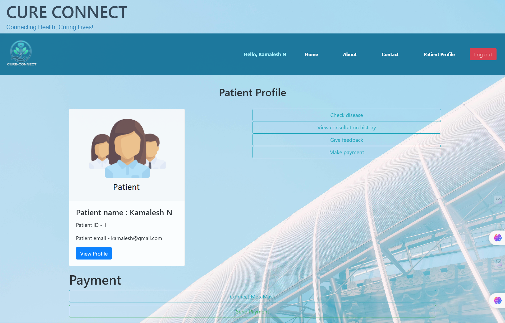
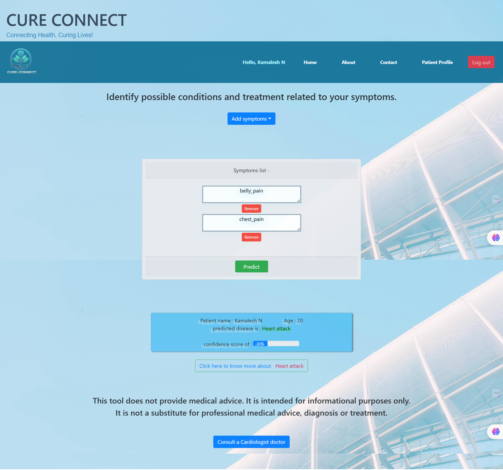
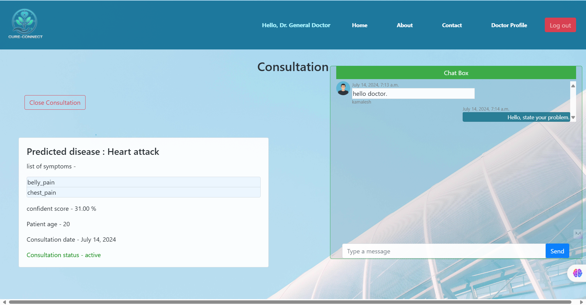
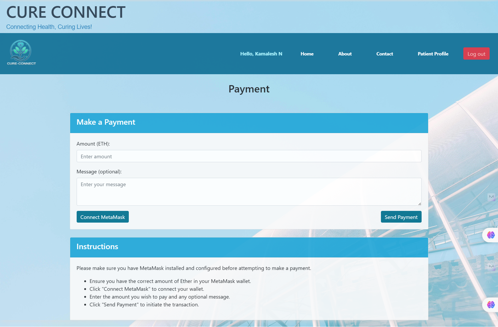
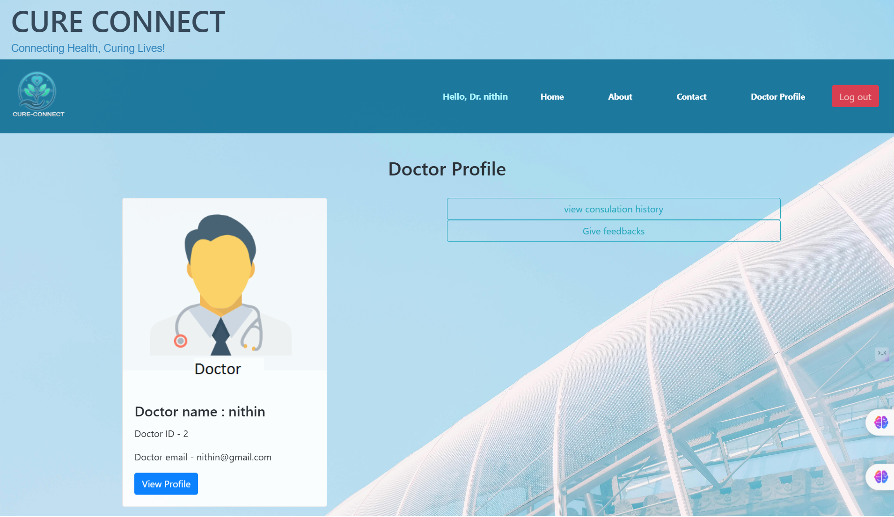

# CureConnect - Healthcare Management System

## Overview

CureConnect is a comprehensive healthcare management system integrating machine learning and blockchain technology to provide a secure and efficient platform for patients, doctors, and administrators. This project addresses key challenges in healthcare by facilitating accurate disease prediction, seamless doctor-patient interaction, and secure payment processing.

## Features

### Home Page


### Patient Interface



- **Account Creation**: Patients can create and manage their accounts.
- **Symptom Input**: Patients can input their symptoms.
- **Disease Prediction**: Machine learning algorithms predict possible diseases and provide confidence levels.



- **Doctor Consultation**: Recommendations for doctors based on predicted diseases.
- **Doctor Communication**: Patients can communicate with doctors via a chatbox.



- **Prescription Management**: Patients can view and purchase prescribed medicines directly from the website.
- **Blockchain Payments**: Secure payment processing through MetaMask.



### Doctor Interface



- **Profile Management**: Doctors can manage their profiles.
- **Patient Profile Viewing**: Doctors can view patient profiles and predicted diseases.
- **Consultation Requests**: Doctors receive and manage consultation requests.
- **Chatbox Communication**: Doctors can communicate with patients.
- **Payment Reception**: Doctors receive payments securely through blockchain via MetaMask.

### Admin Interface

- **Database Management**: Admins can monitor, add, or remove databases.
- **System Monitoring**: Admins can oversee the entire system's operation.

## Technology Stack

- **Frontend**: React.js
- **Backend**: Django
- **Blockchain**: Ethereum, MetaMask, Alchemy
- **Machine Learning**: [Specify ML frameworks and libraries used]

## Installation

1. **Clone the repository**

   ```sh
   git clone https://github.com/your-username/cureconnect.git
   cd cureconnect
   ```

2. **Install dependencies**
   - For the backend:
     ```sh
     cd backend
     pip install -r requirements.txt
     ```
   - For the frontend:
     ```sh
     cd frontend
     npm install
     ```
3. **Setup environment variables**
   - Create a `.env` file in the backend directory and add necessary environment variables.
     Example:
     ```env
     SECRET_KEY=your_secret_key
     DEBUG=True
     ALLOWED_HOSTS=localhost
     ```
4. **Run the application**
   - Start the backend server:
     ```sh
     python manage.py runserver
     ```
   - Start the frontend server:
     ```sh
     npm start
     ```
5. **Usage**
   - Navigate to [http://localhost:3000](http://localhost:3000) to access the frontend.
   - Use the provided interfaces to register as a patient, doctor, or admin.

## Contributing

We welcome contributions from the community. Please fork the repository and create a pull request with your changes.

## License

This project is licensed under the MIT License. See the LICENSE file for more details.

## Contact

For any queries or issues, please contact us at [msgulshan926@gmail.com](mailto:your-email@example.com).

## Teammates:
- [Nithin K](https://github.com/Nithin-Krishnappa)
- [Kamalesh N](https://github.com/kamaleshgowda)
